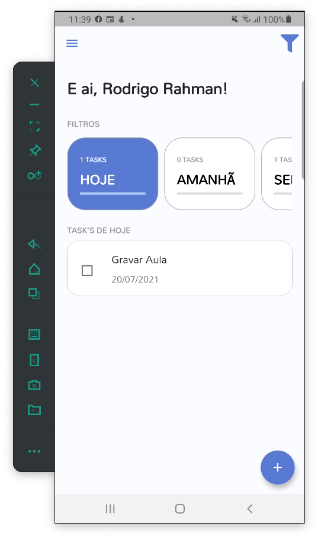
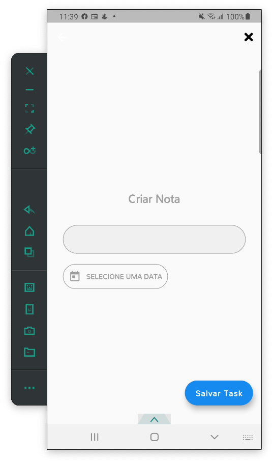
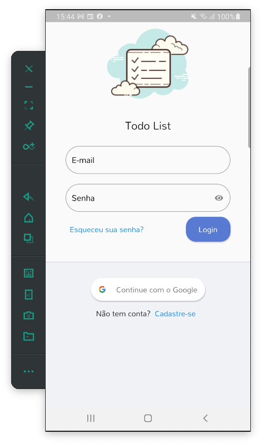

# Projeto de Estudo da [Academia do Flutter](https://academiadoflutter.com.br/)
## Todo List Provider

O projeto **Todo List Provider**, como o próprio nome diz, consiste em um aplicativo para gerenciamento de lista de tarefas a fazer (*Todo*). Veja algumas [imagens](#imagens) do App abaixo!

A arquitetura do projeto inclui:

- O pacote [provider](https://pub.dev/packages/provider), como gerenciador de estado, de rotas e de injeção de dependências.
- O padrão [singleton](https://refactoring.guru/pt-br/design-patterns/singleton), que garante que uma classe tenha apenas uma instância, enquanto provê um ponto de acesso global para essa instância.
- O padrão modular, para garantir um gerênciamento de memório mais eficiente, similarmente ao realizado com outros pacotes como o [flutter_modular](https://modular.flutterando.com.br/docs/intro) ou [getX](https://github.com/jonataslaw/getx#about-get).

Além do pacote [provider](https://pub.dev/packages/provider), também foram utilizados os pacotes

- [sqflite](https://pub.dev/packages/sqflite), SQLite para flutter.
- [path](https://pub.dev/packages/path), manipulação de caminhos: junção, divisão, normalização, etc.
- [synchronized](https://pub.dev/packages/synchronized), mecanismo de bloqueio para impedir o acesso simultâneo ao código assíncrono.
- [nested](https://pub.dev/packages/nested), simplifica a sintaxe para [widgets](https://docs.flutter.dev/ui/widgets-intro) aninhados.
- [flutter_signin_button](https://pub.dev/packages/flutter_signin_button), gera botões de login para diferentes contas de mídia social.
- [google_fonts](https://pub.dev/packages/google_fonts), permite usar fontes do [fonts.google.com](https://fonts.google.com/).
- ...

### Imagens

  
   
  

